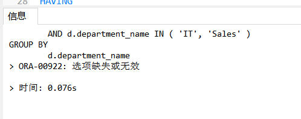

# 实验一：SQL语句的执行计划与优化指导
## 贺云龙 软工3班  学号：201810424110
### 实验目的
> 分析SQL执行计划，执行SQL语句的优化指导。理解分析SQL语句的执行计划的重要作用。
### 实验内容
- 对Oracle12c中的HR人力资源管理系统中的表进行查询与分析。
- 首先运行和分析教材中的样例：本训练任务目的是查询两个部门('IT'和'Sales')的部门总人数和平均工资，以下两个查询的结果是一样的。但效率不相同。
- 设计自己的查询语句，并作相应的分析，查询语句不能太简单。

**语句1**
- sql1
```
set autotrace on

SELECT d.department_name,count(e.job_id)as "部门总人数",
avg(e.salary)as "平均工资"
from hr.departments d,hr.employees e
where d.department_id = e.department_id
and d.department_name in ('IT','Sales')
GROUP BY d.department_name;

```

- **执行结果**


- **执行计划**


- **sql优化指导**


**语句2**
- sql2
```
set autotrace on

SELECT d.department_name,count(e.job_id)as "部门总人数",
avg(e.salary)as "平均工资"
FROM hr.departments d,hr.employees e
WHERE d.department_id = e.department_id
GROUP BY d.department_name
HAVING d.department_name in ('IT','Sales');

```

- **执行结果**


- **执行计划**


### 代码改进

```

SELECT a.department_name,count(e.job_id)as "部门总人数",avg(e.salary)as "平均工资"
from (SELECT department_id,department_name 
      from HR.departments 
      WHERE department_name in ('IT','Sales')) a,hr.employees e
WHERE a.department_id=e.department_id
GROUP BY a.department_name

```


### 实验总结

经过对两条语句的运行与比较，发现语句1比SQL语句2用时更短，且效率更高。因为语句1先选出了结果在进行select查询出相应结果，而语句2先进性select查询出相应结果再进行操作。所以语句1是较优的。对于自己改进后的SQL语句在优化工具执行后并没有给出优化建议。
